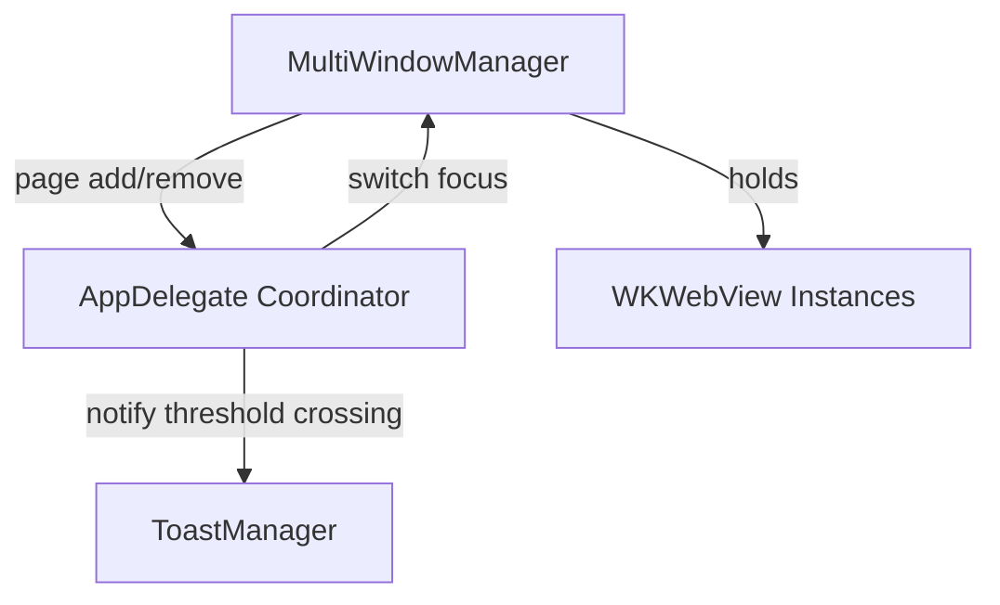

# 设计文档

## 概述（Overview）
本规格包含两项运行时行为优化：
- 并行提问：确保已添加的 AI 窗口在后台保持活跃，切换焦点不重载/销毁，长时请求（流式/推理）不中断。
- 页面数量阈值 Toast：允许打开超过 5 个页面；当页面数从 4→5 时以轻量 Toast 警示“页面较多可能占用内存导致卡顿”，不再提供设置项与“一次会话不再提示”。

该设计尽量复用现有多窗口管理、i18n 与 UI 叠层（overlay）能力，新增的计数与 Toast 模块保持低耦合、易清理。

## 与项目规范的对齐（Steering Alignment）

### 技术标准（tech.md）
- 模块化与单一职责：计数逻辑与 UI 提示分离；外观监听工具化（见下）统一订阅与清理，减少 KVO 样板与退出崩溃风险。
- 资源与生命周期：窗口仅在用户关闭时释放；切换焦点不做程序性暂停；错误 UI 局部呈现。

### 代码结构（structure.md）
- 复用现有 `components/` 管理器与 `app.py` 中的 UI 容器；新增工具类置于 `components/utils/`（若不存在将新建目录/文件）。

## 代码复用分析（Reuse）

### 可复用组件
- AppDelegate（app.py）：窗口根视图、已有错误覆盖层/骨架层；在其上实现轻量 Toast 叠层最为直接。
- MultiWindowManager（components/multiwindow_manager.py）：集中窗口增删与切换，适合承载页面计数与对外通知。
- i18n：复用 `bubblebot/i18n`，新增键值对。

### 集成点
- MultiWindowManager → AppDelegate：在窗口增删时回调通知页面计数变化。
- AppDelegate → Toast：在 4→5 跃迁时触发一次性 Toast 显示。

## 架构（Architecture）

- PageCount 计数流：
  - 入口：MultiWindowManager 在 add/remove 时更新 `active_page_count`。
  - 通知：调用 `AppDelegate.notify_page_count_changed(old, new)`。
  - 决策：AppDelegate 内部判定是否发生 4→5 的跃迁（或之后再次从 <5 返到 5）。
  - 呈现：触发 `ToastManager.show(text, duration)`，3 秒自动消失。
- 并行窗口生存期：
  - 每个窗口绑定独立 WKWebView 与会话上下文（共享 `WKProcessPool` 与 Cookie），切换时避免重建/重载。
  - 仅在用户主动关闭窗口时清理释放；切换焦点不调用 `stopLoading()`/销毁视图。
  - 保证 Map 持有强引用，移出 superview 不导致对象提前释放。

### 模块化原则
- 单文件职责：
  - MultiWindowManager：只负责窗口集合与计数；
  - ToastManager（新）：只负责 Toast 叠层与动画；
  - AppDelegate：作为协调者与 UI 根容器，连接二者。
- 工具化：
  - AppearanceObserver（新，可选）：封装外观变更监听（KVO + 应用级通知）的注册/注销与回调分发。后续逐步替换分散在 `app.py` 与 `settings_window.py` 的监听样板。



## 组件与接口（Components & Interfaces）

### MultiWindowManager（增强）
- Purpose：维护窗口 Map、增删与切换；维护 `active_page_count`。
- Interfaces：
  - `add_window(platform_id) -> window_id`
  - `close_window(window_id)`
  - `get_active_page_count() -> int`
  - 触发回调：`on_page_count_changed(old: int, new: int)`（由 AppDelegate 注册）
- Dependencies：保留对 ObjC 选择子的兼容（switchToWindow_/closeWindow_）
- Reuses：现有多窗口映射与切换逻辑

### AppDelegate（增强）
- Purpose：协调页面计数与 Toast 呈现；确保切换不触发重建/重载。
- Interfaces：
  - `notify_page_count_changed(old, new)`：内部计算阈值跃迁；在 `old < 5 and new == 5` 时调用 Toast。
  - `show_toast(text: str, duration: float = 3.0)`：轻量非阻塞提示。
- Dependencies：MultiWindowManager、ToastManager、i18n
- Reuses：现有根视图、叠层能力

### ToastManager（新增）
- Purpose：在指定窗口/视图上显示短时提示，自动淡入/淡出与销毁；不阻塞用户输入。
- Interfaces：
  - `show(text: str, parent: NSView, duration: float = 3.0)`
- 实现要点：
  - 以 NSView 轻叠层 + 圆角背景 + 模糊/半透明（遵循外观浅/深色对比度）。
  - 使用 Core Animation 做 alpha 动画；自动移除。
  - 多次快速触发时：复用同一层或队列化，避免重叠闪烁。

### AppearanceObserver（新增，可选渐进）
- Purpose：封装外观监听注册/注销（KVO + NSApplication 通知），提供回调 `on_appearance_change()`。
- Interfaces：
  - `bind(button_or_view)` / `unbind()`
  - `set_callback(fn)`
- 使用：先在 AppDelegate/SettingsWindow 试点，后续替换其它分散监听点。

## 数据模型（Data Models）

### WindowEntry（示意）
```
WindowEntry:
- id: str
- platform_id: str
- webview: WKWebView
- state: dict  # 会话相关 UI 状态
```

### PageCountState（示意）
```
PageCountState:
- count: int
- last_threshold_triggered_at: Optional[int]  # 记录上次触发时的计数边界（5），用于防抖
```

## 错误处理（Error Handling）

### 场景 1：Toast 创建失败/父视图缺失
- Handling：打印 WARNING；不中断主流程；不重试。
- User Impact：无提示，但功能不阻断。

### 场景 2：后台窗口网络失败
- Handling：沿用窗口内错误覆盖层；与其它窗口相互独立。
- User Impact：仅失败窗口显示错误提示；其余窗口正常。

## 测试策略（Testing）

### 单元测试
- PageCount 跃迁判定：验证 4→5 触发、>5 不再触发、降到 <5 再次到 5 再触发。
- AppDelegate 通知到 Toast：在测试中以假对象捕获 `show_toast` 调用次数与参数。

### 集成测试
- 模拟多窗口增删：确保计数准确、阈值判定符合要求。
- 切换焦点：验证未触发重载/销毁（可通过保持的对象 id/引用来验证）。

### 端到端（人工验证）
- 打开 5 个页面出现 Toast，继续开第 6 个不再弹；关闭到 4 再开到 5 再出现 Toast。
- 后台窗口执行长请求，切换至其它窗口后仍能完成。
