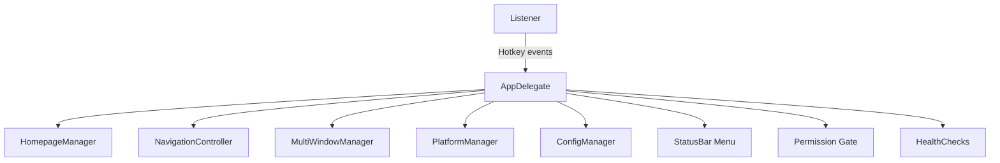

# 项目规范化设计文档（增补版）

## Overview

本设计在既有多窗口/主页/平台管理基础上，补充并规范以下关键能力：
- 全局热键与自定义（去抖与闩锁）。
- 权限门控（辅助功能/麦克风）与 CLI 权限检测一致性。
- 状态栏图标与菜单（浅/深色适配、常用操作统一入口）。
- 配置统一与迁移（集中到 ConfigManager，保留现有路径兼容与备份）。
- 健康检查与稳定性（崩溃环保护、本地日志）。
- UI 动效与窗口控件（最小化/关闭/透明度）。
- 命名一致性与可维护性（方法命名风格统一）。

以上能力均围绕“轻量、友好、可扩展”目标，避免侵入式变更，复用既有实现并抽象稳定接口。

## Steering Document Alignment

### Technical Standards
- 遵循 PEP8/Black（line-length 88）与本仓库命名约定（函数/模块 snake_case，类 CamelCase，常量 UPPER_SNAKE）。
- UI/事件代码保持小而可组合；核心逻辑下沉至 helpers/components/models。

### Project Structure
- 保持 src 布局：`src/bubblebot/` 作为主包；`tests/` 为 Pytest 套件。
- 入口：`BubbleBot.py` 与 `python -m bubblebot.main`；安装后 console script `bubblebot`。

## Code Reuse Analysis

### Existing Components to Leverage
- `app.AppDelegate`: 窗口/状态栏/权限提示/主视图装配（继续复用并瘦身为协调者）。
- `listener.py`: 全局快捷键捕获与自定义 UI（保留并增强去抖、持久化）。
- `components.*`: `HomepageManager`、`NavigationController`、`MultiWindowManager`、`PlatformManager`（继续作为领域组件）。
- `models.*`: `AIWindow`、`WindowManager`、`PlatformConfig`（数据模型稳定复用）。
- `health_checks.py`: 崩溃环保护/日志（沿用并补充分类）。

### Integration Points
- WebKit 与 PyObjC 保持不变。
- 权限/系统接口：ApplicationServices（AX 权限）、AVFoundation（麦克风）。
- 配置存储：文件系统 JSON（用户态与平台清单），新增统一管理器封装。

## Architecture

采用“薄协调者 + 粗粒度组件 + 纯模型/工具”的分层：
- AppDelegate 负责装配、生命周期与菜单/图标切换；逻辑入组件。
- Listener 专注键盘与触发器 UI，触发动作调用 AppDelegate 公共接口。
- 组件层（Homepage/MultiWindow/Platform/Config）：隔离职责；通过数据模型与简单接口交互。
- 工具层（health_checks、error_handler 等）：跨域能力复用。

### Modular Design Principles
- 单文件职责、组件隔离、服务层分离、工具模块化。



## Components and Interfaces

### Listener（全局热键监听）
- Purpose: 捕获全局按键、提供“Set New Trigger”覆盖层 UI、持久化新快捷键。
- Interfaces:
  - `load_custom_launcher_trigger()`：从 `~/Library/Logs/bubblebot/custom_trigger.json` 读取覆盖默认组合键。
  - `set_custom_launcher_trigger(app)`：显示 UI，写入新配置并反馈。
  - `global_show_hide_listener(app)`：返回 CGEvent 回调，内含去抖与闩锁；触发 `app.showWindow_/hideWindow_`。
- Dependencies: AppKit/Quartz；`constants.LAUNCHER_TRIGGER(_MASK)`。
- Reuses: 现有实现，保留路径与文件格式。

### Permission Gate（权限门控）
- Purpose: 统一辅助功能/麦克风权限提示与 CLI 检测。
- Interfaces:
  - `launcher.check_permissions(ask)` / `--check-permissions`（返回码一致，`PERMISSION_CHECK_EXIT=1`）。
  - `ensure_accessibility_permissions()`（必要时弹窗/等待）。
  - App 环境开关：`BB_NO_TAP=1` 跳过 event tap；`BB_NO_MIC_PROMPT=1` 跳过麦克风弹窗。
- Reuses: `launcher.py`、`app.py` 现有逻辑。

### Status Bar Menu（状态栏菜单）
- Purpose: 统一操作入口；浅/深色图标自适应，Dock 图标 `logo/icon.icns`。
- Interfaces: Show/Hide、Home、Clear Web Cache、Set New Trigger、Install/Uninstall Autolauncher、Quit。
- Reuses: `app.py` 既有实现；外观监听 `effectiveAppearance` 驱动黑/白图标切换。

### ConfigManager（新增）
- Purpose: 统一配置访问与迁移，规避多处读写分散导致的不一致。
- Interfaces（建议路径 `components/config_manager.py`）:
  - `load_user_config()` / `save_user_config()`：`~/Library/Application Support/BubbleBot/config.json`。
  - `load_platforms()` / `save_platforms()`：`~/.bubblebot/platforms.json` + `platforms_backup*.json`。
  - `migrate_if_needed()`：当检测到旧路径/字段差异时，迁移并自动备份。
  - `validate()`：返回错误与警告集合（复用 PlatformManager 的 validate 结果）。
- Dependencies: `PlatformManager`、`HomepageManager`；文件系统。
- Reuses: 现有两套配置路径与备份策略。

### MultiWindowManager（多窗口）
- Purpose: 统一窗口生命周期/切换/拖拽区域/透明度控制；方法命名统一。
- Interfaces:
  - `createWindowForPlatform_(platform_id)`、`closeWindow_(window_id)`、`switchToWindow_(window_id)`（统一驼峰或下划线，建议下划线：`switch_to_window_` 并全仓统一）。
  - 透明度控制：`increaseTransparencyAction:`/`decreaseTransparencyAction:`。
- Reuses: 现有 `AIWindow/WindowManager` 数据模型与 UI 代码。

### Error/Health（错误与健康）
- Purpose: 异常分类记录、崩溃环保护（60s>3 次熔断）、日志路径统一。
- Interfaces: `health_checks.health_check_decorator`、`reset_crash_counter()`；新增 `utils/error_handler.py` 捕获分类（网络、权限、WebView 加载、配置）。

## Data Models

### AIWindow / WindowManager（保持）
- 维持窗口状态/几何/标题/URL/会话数据；限制总窗口<=5、单平台<=5。

### PlatformConfig / AIServiceConfig（保持）
- 平台清单/启用列表/默认平台；校验重复 ID/字段缺失。

### UserConfig（新增建议）
```
class UserConfig:
  default_ai: Optional[str]
  enabled_platforms: List[str]
  platform_windows: Dict[str, Dict[str, Dict]]
  window_positions: Dict[str, Any]
  ui_preferences: Dict[str, Any]
```
- 由 ConfigManager 读写，HomepageManager 只通过接口访问。

## Error Handling

### 事件监听器创建失败（无 AX 权限）
- Handling: 提示到系统设置授予辅助功能权限；允许通过菜单/图标手动显示窗口；记录日志。
- User Impact: 仍可手动使用应用；快捷键不可用直至授权。

### 配置文件损坏/字段缺失
- Handling: 自动备份并以默认配置启动；显示“已重置为默认设置”。
- User Impact: 可继续使用；需重新选择默认 AI/平台。

### WebView 加载失败
- Handling: 当前窗口显示重试/诊断入口，不影响其他窗口。
- User Impact: 单窗口可重试或关闭，其他窗口不受影响。

### 崩溃环/异常
- Handling: 健康检查熔断并输出操作指引（删除计数文件恢复）。
- User Impact: 避免反复重启占用资源；提供清晰恢复路径。

## Testing Strategy

### Unit
- Listener：去抖与闩锁逻辑；自定义触发器持久化。
- ConfigManager：读写/备份/迁移/校验；路径与异常处理。
- PlatformManager：增删/启用/默认/校验。
- WindowManager：创建/切换/限制；透明度与关闭逻辑。

### Integration
- 权限门控开关：`BB_NO_TAP/BB_NO_MIC_PROMPT` 的路径与回退。
- 状态栏菜单：菜单项动作（仅在 Darwin 环境验证，CI 跳过）。
- 配置统一：旧路径 → 新路径迁移的全链路；导入/导出。

### End-to-End（本机）
- 首启引导 → 默认 AI 选择 → 多平台/多窗口 → 切换/关闭/恢复位置。
- 浅/深色模式切换下的状态栏图标与 UI 视觉检查。
- 打包后权限/热键/菜单回归。

## 命名一致性与维护建议
- 统一方法命名：建议 Objective‑C 选择子保持现状（末尾 `_`），但 Python 层函数/属性统一 snake_case（如 `switch_to_window_`）。
- 在 `app.py` 对 `MultiWindowManager` 的调用处统一改名，避免运行时找不到方法。
